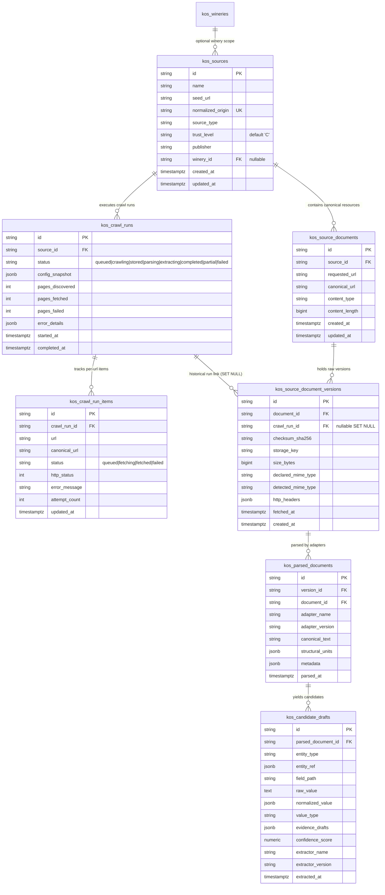

# Refined Implementation Plan - Step 2C: Source Registry & Raw Website Ingestion Foundation

## Architectural Goal
To establish a production-grade, secure KOS Source Layer allowing users via Dashboard to add public websites (e.g. `https://aurelius.md` or `https://wineofmoldova.com`) without touching code (`registry.js`).

A **Source** is a distinct, first-class KOS entity.
- A Website is NOT a Document.
- A Document is NOT a ParsedDocument.
- A ParsedDocument is NOT a Published Fact.
- Each concept has a separate lifecycle, database table, and contract boundary.

---

## 1. Entity Relationship (ER) Diagram



---

## 2. SQL Schema Definition & Migration Plan

### Migration `v2_sources_and_raw_ingestion_schema` (`src/kos/db/kosSchema.js`)

```sql
-- 1. Source Registry (seed_url & normalized_origin UNIQUE, trust_level DEFAULT 'C')
CREATE TABLE IF NOT EXISTS kos_sources (
    id TEXT PRIMARY KEY,
    name TEXT NOT NULL,
    seed_url TEXT NOT NULL,
    normalized_origin TEXT NOT NULL UNIQUE,
    source_type TEXT NOT NULL CHECK (source_type IN ('official_website', 'industry_portal', 'government', 'contest', 'media', 'catalog', 'other')),
    trust_level TEXT NOT NULL DEFAULT 'C' CHECK (trust_level IN ('A', 'B', 'C', 'D')),
    publisher TEXT,
    winery_id TEXT REFERENCES kos_wineries(id) ON DELETE SET NULL,
    created_at TIMESTAMPTZ DEFAULT NOW(),
    updated_at TIMESTAMPTZ DEFAULT NOW()
);
CREATE INDEX IF NOT EXISTS idx_kos_sources_winery ON kos_sources(winery_id);
CREATE INDEX IF NOT EXISTS idx_kos_sources_origin ON kos_sources(normalized_origin);

-- 2. Crawl Runs Tracker
CREATE TABLE IF NOT EXISTS kos_crawl_runs (
    id TEXT PRIMARY KEY,
    source_id TEXT NOT NULL REFERENCES kos_sources(id) ON DELETE CASCADE,
    status TEXT NOT NULL CHECK (status IN ('queued', 'crawling', 'stored', 'parsing', 'extracting', 'completed', 'partial', 'failed')),
    config_snapshot JSONB NOT NULL,
    pages_discovered INT DEFAULT 0,
    pages_fetched INT DEFAULT 0,
    pages_failed INT DEFAULT 0,
    error_details JSONB,
    started_at TIMESTAMPTZ DEFAULT NOW(),
    completed_at TIMESTAMPTZ,
    created_at TIMESTAMPTZ DEFAULT NOW()
);
CREATE INDEX IF NOT EXISTS idx_kos_crawl_runs_source ON kos_crawl_runs(source_id);
CREATE INDEX IF NOT EXISTS idx_kos_crawl_runs_status ON kos_crawl_runs(status);

-- 3. Per-URL Crawl Run Items (Resilient per-URL tracking for recovery)
CREATE TABLE IF NOT EXISTS kos_crawl_run_items (
    id TEXT PRIMARY KEY,
    crawl_run_id TEXT NOT NULL REFERENCES kos_crawl_runs(id) ON DELETE CASCADE,
    url TEXT NOT NULL,
    canonical_url TEXT NOT NULL,
    status TEXT NOT NULL CHECK (status IN ('queued', 'fetching', 'fetched', 'failed')),
    http_status INT,
    error_message TEXT,
    attempt_count INT DEFAULT 0,
    created_at TIMESTAMPTZ DEFAULT NOW(),
    updated_at TIMESTAMPTZ DEFAULT NOW()
);
CREATE INDEX IF NOT EXISTS idx_kos_crawl_items_run ON kos_crawl_run_items(crawl_run_id);
CREATE INDEX IF NOT EXISTS idx_kos_crawl_items_status ON kos_crawl_run_items(status);

-- 4. Source Documents (Canonical URL mapping)
CREATE TABLE IF NOT EXISTS kos_source_documents (
    id TEXT PRIMARY KEY,
    source_id TEXT NOT NULL REFERENCES kos_sources(id) ON DELETE CASCADE,
    requested_url TEXT NOT NULL,
    canonical_url TEXT NOT NULL,
    content_type TEXT,
    content_length BIGINT,
    created_at TIMESTAMPTZ DEFAULT NOW(),
    updated_at TIMESTAMPTZ DEFAULT NOW(),
    CONSTRAINT uk_source_canonical_url UNIQUE (source_id, canonical_url)
);
CREATE INDEX IF NOT EXISTS idx_kos_source_docs_source ON kos_source_documents(source_id);
CREATE INDEX IF NOT EXISTS idx_kos_source_docs_canonical ON kos_source_documents(canonical_url);

-- 5. Immutable Raw Versions (No duplicate source_id, crawl_run_id ON DELETE SET NULL)
CREATE TABLE IF NOT EXISTS kos_source_document_versions (
    id TEXT PRIMARY KEY,
    document_id TEXT NOT NULL REFERENCES kos_source_documents(id) ON DELETE CASCADE,
    crawl_run_id TEXT REFERENCES kos_crawl_runs(id) ON DELETE SET NULL,
    checksum_sha256 TEXT NOT NULL,
    storage_key TEXT NOT NULL,
    size_bytes BIGINT NOT NULL,
    declared_mime_type TEXT NOT NULL,
    detected_mime_type TEXT NOT NULL,
    http_headers JSONB NOT NULL,
    fetched_at TIMESTAMPTZ NOT NULL,
    created_at TIMESTAMPTZ DEFAULT NOW(),
    CONSTRAINT uk_document_checksum UNIQUE (document_id, checksum_sha256)
);
CREATE INDEX IF NOT EXISTS idx_kos_doc_versions_document ON kos_source_document_versions(document_id);
CREATE INDEX IF NOT EXISTS idx_kos_doc_versions_checksum ON kos_source_document_versions(checksum_sha256);
CREATE INDEX IF NOT EXISTS idx_kos_doc_versions_crawl_run ON kos_source_document_versions(crawl_run_id);

-- 6. Parsed Documents (Format Adapter Output)
CREATE TABLE IF NOT EXISTS kos_parsed_documents (
    id TEXT PRIMARY KEY,
    version_id TEXT NOT NULL REFERENCES kos_source_document_versions(id) ON DELETE CASCADE,
    document_id TEXT NOT NULL REFERENCES kos_source_documents(id) ON DELETE CASCADE,
    adapter_name TEXT NOT NULL,
    adapter_version TEXT NOT NULL,
    canonical_text TEXT NOT NULL,
    structural_units JSONB NOT NULL,
    metadata JSONB,
    parsed_at TIMESTAMPTZ DEFAULT NOW(),
    CONSTRAINT uk_version_adapter UNIQUE (version_id, adapter_name, adapter_version)
);
CREATE INDEX IF NOT EXISTS idx_kos_parsed_docs_version ON kos_parsed_documents(version_id);

-- 7. Candidate Drafts (Deterministic Extraction Outputs)
CREATE TABLE IF NOT EXISTS kos_candidate_drafts (
    id TEXT PRIMARY KEY,
    parsed_document_id TEXT NOT NULL REFERENCES kos_parsed_documents(id) ON DELETE CASCADE,
    entity_type TEXT NOT NULL,
    entity_ref JSONB NOT NULL,
    field_path TEXT NOT NULL,
    raw_value TEXT NOT NULL,
    normalized_value JSONB,
    value_type TEXT NOT NULL,
    evidence_drafts JSONB NOT NULL,
    confidence_score NUMERIC(3,2) NOT NULL,
    extractor_name TEXT NOT NULL,
    extractor_version TEXT NOT NULL,
    extracted_at TIMESTAMPTZ DEFAULT NOW()
);
CREATE INDEX IF NOT EXISTS idx_kos_drafts_parsed_doc ON kos_candidate_drafts(parsed_document_id);
```

---

## 3. Storage Strategy & Atomic Protocol

### Atomic Raw Storage Protocol
1. **Fetch**: Stream bytes to temp file/buffer.
2. **Compute**: Calculate SHA-256 hash `checksum`.
3. **Verify**: Check `uk_document_checksum` in PostgreSQL. If version exists, skip object write and return existing version.
4. **Write Object**: Save raw bytes to ObjectStorage key `raw/{checksum}.bin`.
5. **Write DB**: Insert record into `kos_source_document_versions` in PostgreSQL inside transaction.
6. **Cleanup on Failure**: If DB transaction fails, delete orphan blob `raw/{checksum}.bin`.

---

## 4. SSRF Threat Model & Socket Pinning

1. **Reject Credentials**: Reject URLs containing `@` (embedded credentials) with `400 Bad Request`.
2. **Syntactic & IDN**: Convert Punycode to Unicode/ASCII, enforce lowercasing, check port in `[80, 443]`.
3. **DNS Validation & Direct Socket Pinning**: Perform DNS resolution (`dns.resolve4` / `dns.resolve6`). Verify resolved IPs against CIDRs. When issuing HTTP request, connect directly to the already-verified IP address via `lookup` hook or custom Agent, avoiding TOCTOU DNS rebinding.

---

## 5. Phased Execution Breakdown

### Phase 1: Step 2C.1 — Schema, Migrations & Contracts (Current Scope)
- Implement `kosSchema.js` migration `v2_sources_and_raw_ingestion_schema`.
- Implement `ssrfProtection.js` (URL parsing, SSRF rules, IP pinning).
- Implement `sourceRegistry.js` (Source CRUD).
- Implement `rawResourceStorage.js` (ObjectStorage + DB metadata).
- Execute mandatory real PostgreSQL integration test suite `tests/kosSchema.postgres.integration.test.js`.

### Phase 2: Step 2C.2 — Crawler Provider & Crawl Run Worker (Follow-up Scope)
- Implement `websiteCrawlerProvider.js` & `crawlRunWorker.js` (`kos_crawl_run_items` tracking, recovery).

### Phase 3: Step 2C.3 — Dashboard & End-to-End Slice (Follow-up Scope)
- Implement REST API endpoints in `src/server.js` and Dashboard UI in `public/dashboard.html`.
